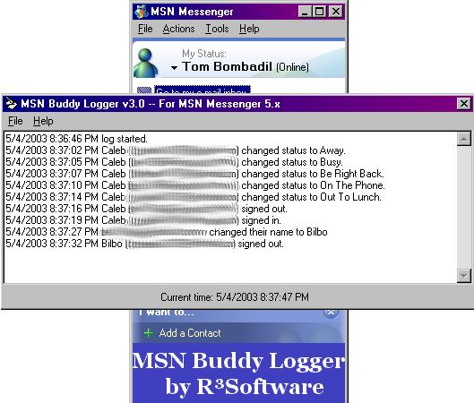

## A Buddy Logger for MSN Messenger 5\.x and 6\.x

### Description

MSN Buddy Logger is a program that logs when your buddies on your MSN Messenger list sign in and out, change their status, change their name, change their phone #, etc. You can save the log to a text file for future reference or to show to your friends to prove that they *were* online at 2:00 AM. :-D This program is for MSN Messenger 5.x and 6.x, also, this program only works when you are *signed in* to MSN Messenger; if you have DSL (or similar) and are signed in to MSN Messenger all the time like I am, then you will find this program very usefull. It's very interesting to see what you miss when you're not online...
 
### More Info
 

             |
---                |---
**Submitted On**   |2003-05-04 20:29:50
**By**             |[Caleb Martin](https://github.com/Planet-Source-Code/PSCIndex/blob/master/ByAuthor/caleb-martin.md)
**Level**          |Intermediate
**User Rating**    |4.5 (18 globes from 4 users)
**Compatibility**  |VB 5\.0, VB 6\.0
**Category**       |[Internet/ HTML](https://github.com/Planet-Source-Code/PSCIndex/blob/master/ByCategory/internet-html__1-34.md)
**World**          |[Visual Basic](https://github.com/Planet-Source-Code/PSCIndex/blob/master/ByWorld/visual-basic.md)
**Archive File**   |[A\_Buddy\_Lo158362542003\.zip](https://github.com/Planet-Source-Code/caleb-martin-a-buddy-logger-for-msn-messenger-5-x-and-6-x__1-45260/archive/master.zip)

